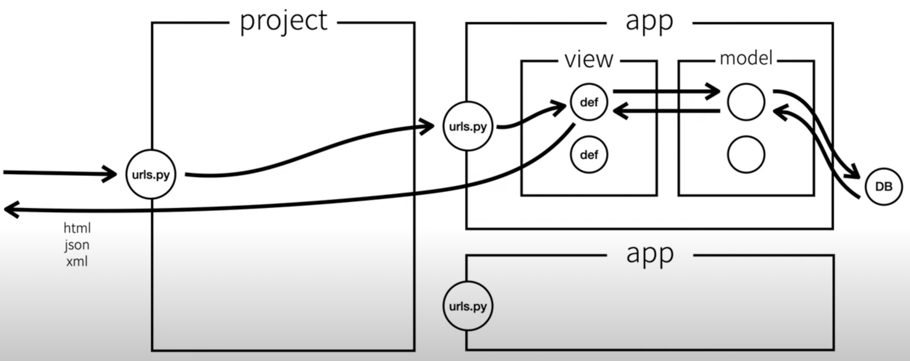

# Setups
## Install Django
`> python3 -m pip install django`

## Check Available Tasks
`> django-admin`

## Setup Django Project
`> django-admin startproject [폴더명] [디렉토리]` 
ex) django-admin startproject myproject .

## How to run
- to check for available tasks
    - `> python3 manage.py`
- run server (default port = 8000)
    - `> python3 manage.py runserver`
- to run server with different port
    - `> python3 manage.py runserver [port_number]`

## Setup Django App
`> django-admin startapp [폴더명]` 

## ※ Django Structure

- Routing : Client Request -> project route -> app route -> app view -> (처리) -> Client Response (HttpResponse)